<div align="center">



</div>


<br/>

<div align="center">

[](https://your-portfolio.com)&nbsp;&nbsp;
[](https://www.linkedin.com/in/abdal-asad-671496356/)&nbsp;&nbsp;
[](https://github.com/Aaren08)&nbsp;&nbsp;
[](mailto:engrabdalasad@gmail.com)&nbsp;&nbsp;
[](https://discord.gg/Jzn5RTeCyv)

</div>

<br/>


<br/>

## `> whoami`

```typescript
const engineer = {
  name: "Abdal Asad",
  role: "Full Stack Engineer",
  location: "Pakistan",

  architecture: ["Microservices", "Event-Driven", "JAMstack", "API-First"],
  frontend: ["Next.js", "React", "TypeScript", "Tailwind CSS"],
  backend: ["Node.js", "Express", "REST", "WebSockets"],
  databases: ["PostgreSQL", "MongoDB", "Redis", "Drizzle", "Firebase"],
  infrastructure: ["Docker", "GitHub Actions", "Vercel", "CI/CD"],

  currentlyBuilding:
    "Scalable full-stack applications with AI-integrated workflows",
  openTo: ["Collaboration", "OSS contributions", "Product engineering"],

  philosophy: [
    "Performance is a feature, not an afterthought",
    "Clean code is a form of respect for future maintainers",
    "The best architecture is the one that's never noticed",
  ],
} as const;
```

<br/>


## `> engineering-principles`

<table>
<tr>
<td width="50%" valign="top">

**`[ Architecture ]`**

- Design for scale from day one
- Decouple business logic from framework concerns
- API contracts as the source of truth
- Stateless services, stateful data layers

</td>
<td width="50%" valign="top">

**`[ Execution ]`**

- Performance budgets enforced at CI level
- Security-conscious by default, not as an add-on
- Observability built in, not bolted on
- Test at the boundary, not the implementation

</td>
</tr>
<tr>
<td width="50%" valign="top">

**`[ Frontend ]`**

- Component APIs that read like documentation
- Render performance as a first-class concern
- Accessibility is not optional
- Design systems over one-off components

</td>
<td width="50%" valign="top">

**`[ Developer Experience ]`**

- Automate everything repeatable
- Linting + formatting enforced, not suggested
- Git history tells a story
- README-driven development

</td>
</tr>
</table>

<br/>


## `> core-stack`

<div align="center">

#### Interface Layer


#### System Layer


#### Infrastructure


#### Expanding Into


</div>

<br/>


## `> current-focus`

```sh
$ aaren status --verbose

[✓] Building    → Scalable full-stack applications (Next.js + Node + PostgreSQL)
[✓] Studying    → System design patterns & distributed systems
[✓] Exploring   → AI-integrated developer workflows & LLM tooling
[✓] Improving   → CI/CD pipelines & cloud infrastructure
[~] Next        → Open-source contributions to developer tooling

uptime: 493 commits | 36 repositories | 16 contributions
```

<br/>


## `> metrics-dashboard`

<div align="center">



</div>

<br/>

### Contribution Activity

<div align="center">


</div>

<br/>

### Analytics

<div align="center">


</div>

<br/>


## `> featured-projects`

<div align="center">

<table>
<tr>
<td width="50%" valign="top">

### [BookWise](https://github.com/Aaren08/bookwise-JSM)

`Next.js` `TypeScript` `PostgreSQL` `Drizzle ORM`

> Enterprise-grade library management platform with dual-surface architecture — public reader interface and protected admin panel. Implements complete auth, real-time features, and transactional email integration.

**Engineering highlights:**

- Role-based access control across public/admin surfaces
- Real-time data synchronization via Upstash Redis pub/sub and SSE layer
- Transactional email service integration
- Optimized Drizzle queries with connection pooling

</td>
<td width="50%" valign="top">

### More Coming

`In Progress`

> Currently architecting a set of production-grade applications focused on AI-integrated workflows and developer tooling.

**Planned scope:**

- AI-augmented productivity tools
- Realtime collaboration primitives
- Open-source developer utilities
- Performance-benchmarked UI systems

</td>
</tr>
</table>

</div>

<br/>


## `> open-source-posture`

<div align="center">

I build in public, contribute upstream, and believe the best products start with the best developer experience.

**Open to:**
&nbsp;&nbsp;`Modern frontend projects` &nbsp;·&nbsp; `Developer tooling` &nbsp;·&nbsp; `Performance optimization` &nbsp;·&nbsp; `AI-integrated applications` &nbsp;·&nbsp; `OSS collaboration`

</div>

<br/>


## `> connect`

<div align="center">

<a href="https://github.com/Aaren08">
  
</a>
&nbsp;
<a href="https://www.linkedin.com/in/abdal-asad-671496356/">
  
</a>
&nbsp;
<a href="https://your-portfolio.com">
  
</a>

</div>

<br/>


<div align="center">

```
Building systems with precision, scalability, and deliberate design.
```

<sub>
  <code>Last updated automatically every 12h via GitHub Actions</code>
</sub>

</div>
